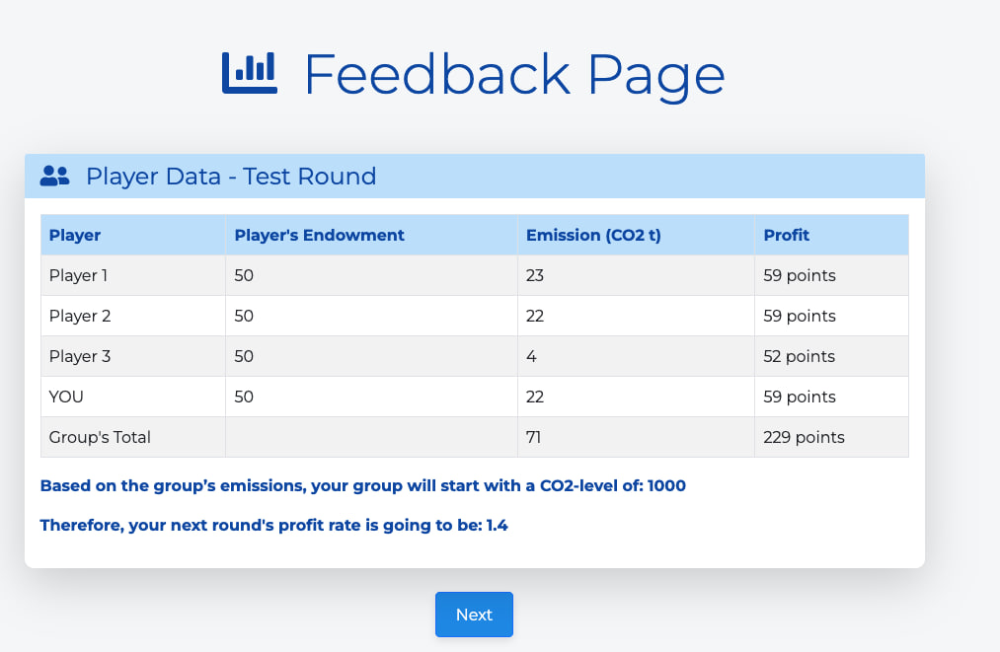

# CPR Game

This repository contains the implementation of a Common-Pool Resource (CPR) game experiment using oTree. The game simulates scenarios where participants must balance their own profit with the sustainable management of Earth's atmospheric resources.

## Screenshots

Here are some screenshots from the game:

### Screenshot 1


### Screenshot 2


### Screenshot 3


### Screenshot 4



### Screenshot 5


### Screenshot 6


## Project Structure

- `requirements.txt`: Lists the dependencies required for the project.
- `_templates/global/Page.html`: Base HTML template for the project.
- `CPR_game/`: Contains the main game logic and templates.
  - `models.py`: Defines the game models and logic.
  - `pages.py`: Defines the sequence and logic of the game pages.
  - `templates/CPR_game/`: Contains the HTML templates for the game pages.
- `_static/global/empty.css`: Placeholder for global CSS.
- `.gitignore`: Specifies files and directories to be ignored by git.
- `settings.py`: Configuration settings for the oTree project.
- `Procfile`: Defines the commands to run the web server and worker.
- `.vscode/settings.json`: VSCode settings for the project.
- `README.md`: This file.

## Game Description

The CPR game consists of multiple rounds where participants make decisions about CO2 emissions. The game has two main variables: Heterogeneity and Delayed Consequences.

### Heterogeneity

Participants play two games:

1. Equal endowments: All players receive an equal budget of 50 points per round.
2. Unequal endowments: Players receive different budgets (30 or 70 points) within the same group.

### Delayed Consequences

Participants receive feedback on their resource use and profit consequences either immediately after each round or after a set of rounds.

## Installation

1. Clone the repository:

   ```sh
   git clone https://github.com/awerks/CPR-game.git
   cd CPR-game
   ```

2. Create a virtual environment and activate it:

   ```sh
   python -m venv venv
   source venv/bin/activate  # On Windows use `venv\Scripts\activate`
   ```

3. Install the dependencies:

   ```sh
   pip install -r requirements.txt
   ```

4. Run the oTree server:
   ```sh
   otree devserver
   ```

## Usage

To start the game, navigate to `http://localhost:8000` in your web browser. You can configure different game sessions in the `settings.py` file.

## License

This project is licensed under the MIT License. See the [LICENSE](LICENSE) file for details.

## Acknowledgements

This project was developed using [oTree](https://www.otree.org/), an open-source platform for behavioral research.
